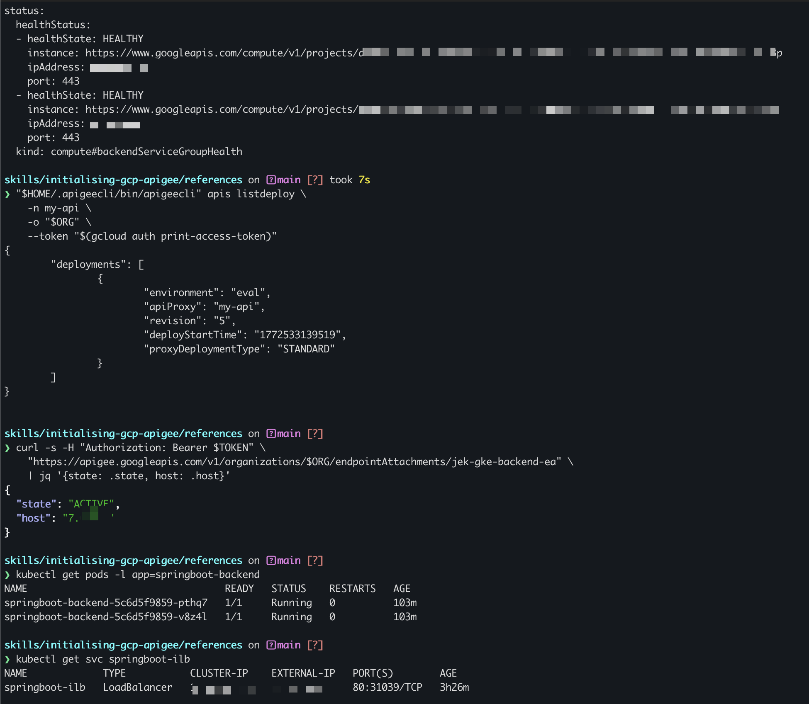
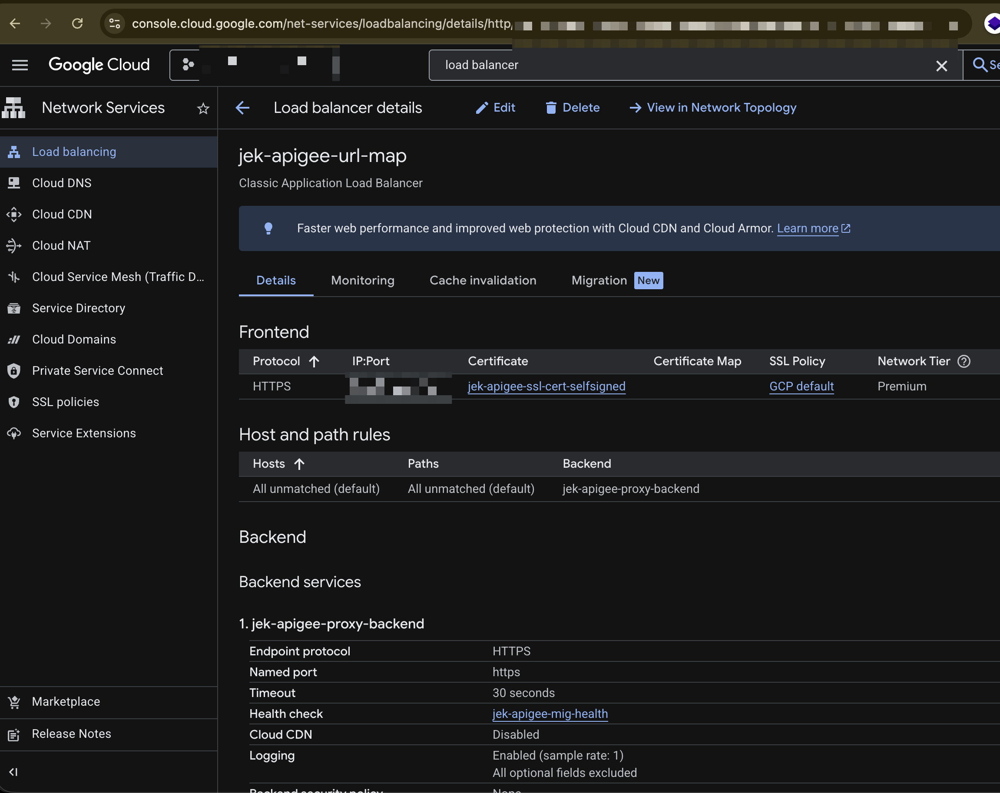
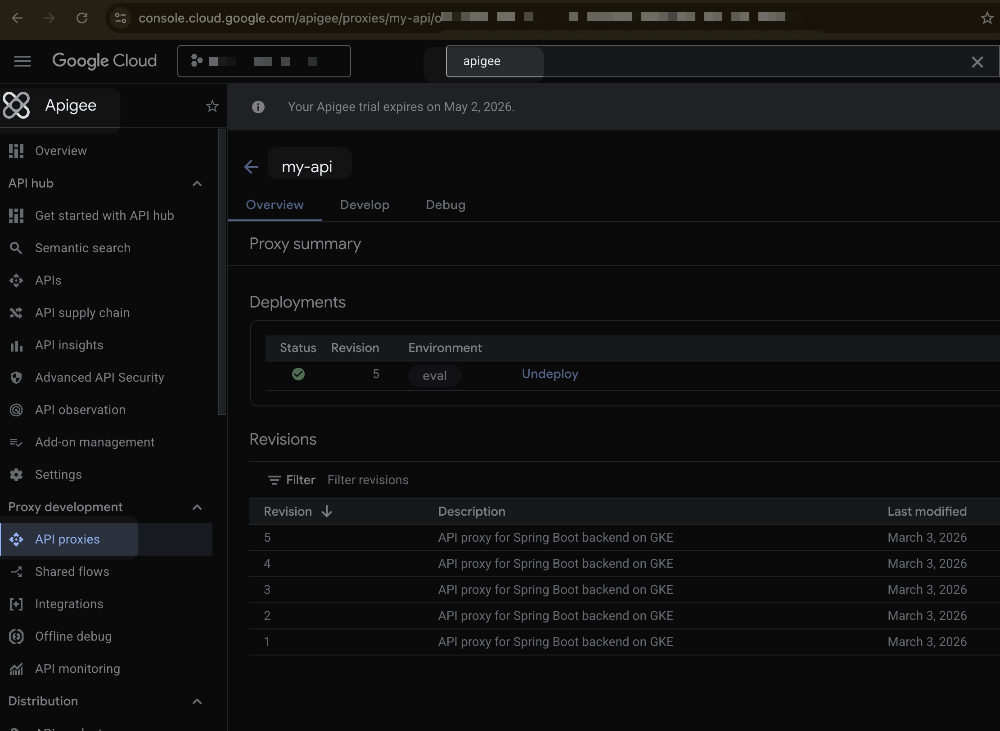
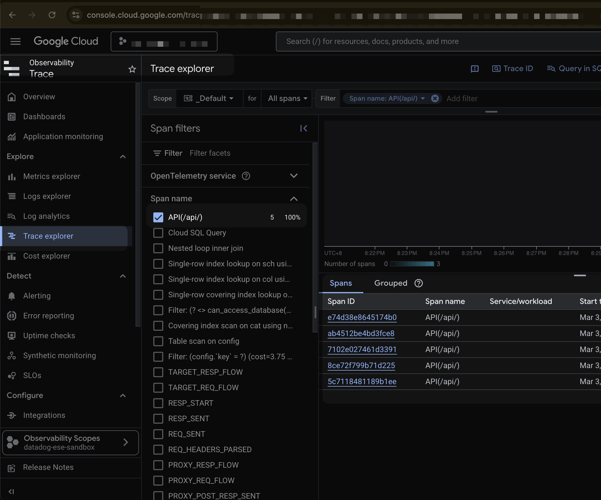
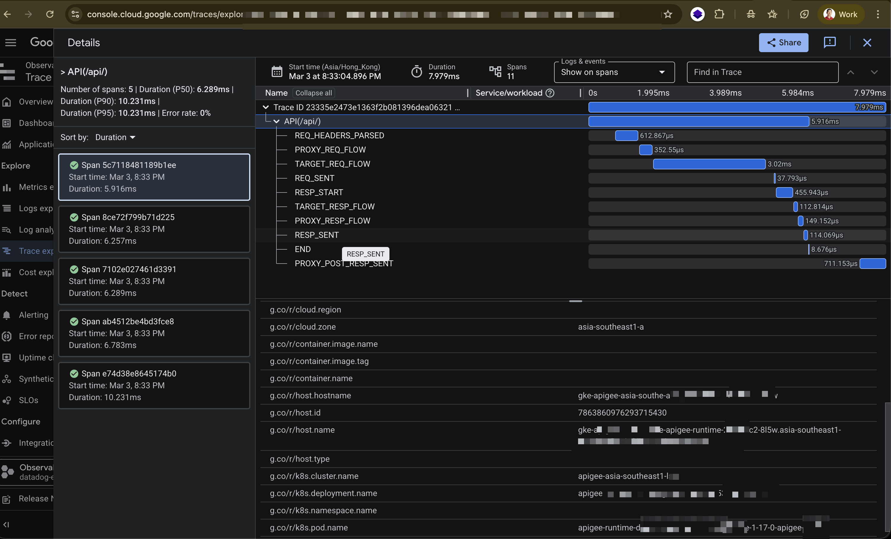
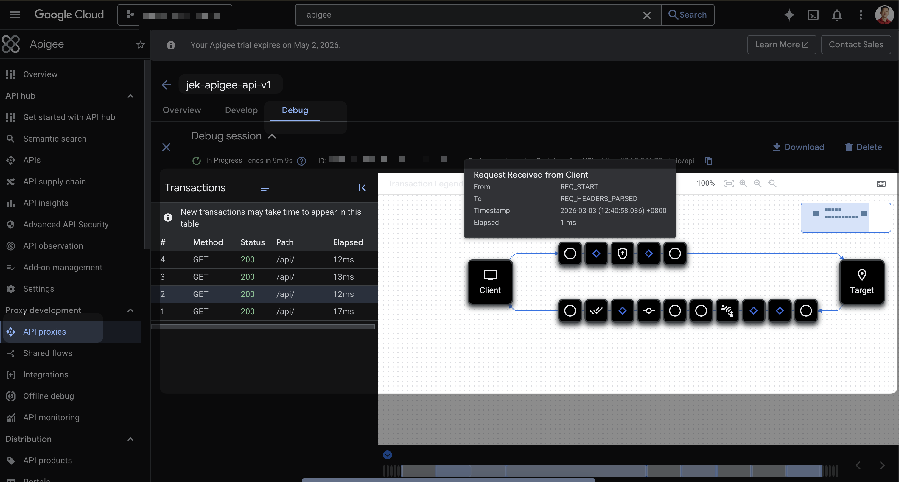

# GCP Apigee X Implementation Guide

Complete guide for setting up Apigee X as a middleware layer between an Android app and a GKE-hosted Spring Boot backend, with CLI automation and OpenTelemetry observability.

**Architecture**: Android App → External HTTPS LB → Apigee X → PSC → GKE ILB → Spring Boot

**Estimated provisioning time**: 45–90 minutes end-to-end (instance creation is the bottleneck at 30–60 min).

---

## Alternative: Apigee Emulator (Local Dev/Test)

For rapid proxy development and testing without waiting for cloud provisioning, use the Apigee Emulator. It runs locally via Docker and starts instantly.

```bash
# Install the Apigee CLI tools
npm install -g apigee-emulator

# Or run directly with Docker
docker run -p 8998:8998 google/apigee-emulator
```

- **Startup time**: Seconds (vs 45+ min for cloud)
- **Cost**: Free
- **Use case**: Developing and debugging API proxy policies (VerifyAPIKey, SpikeArrest, AssignMessage, etc.)
- **Limitations**: No PSC connectivity, no Cloud Trace integration, no real GKE traffic routing — only emulates proxy policy execution locally

> **When to use**: Use the emulator for iterating on proxy bundles locally, then deploy the final version to your cloud Apigee X instance (Phase 4) for end-to-end testing with PSC + Cloud Trace.

If you only need the emulator, skip to Phase 4.2 (Create the API Proxy Bundle) to develop your proxy, then test it locally before deploying to cloud.

---

## Variables

Set these once and use throughout all phases:

```bash
export PROJECT="datadog-ese-sandbox"
export REGION="asia-southeast1"
export AX_REGION="asia-southeast1"   # Analytics region
export NETWORK="jek-vpc"
export ORG="$PROJECT"                # Apigee org name = project ID

# If you used Option A (eval org), use these:
export APIGEE_INSTANCE="eval-instance"
export APIGEE_ENV="eval"

# If you used Option B (paid org), use these instead:
# export APIGEE_INSTANCE="jek-instance-$REGION"
# export APIGEE_ENV="prod"
```

---

## Phase 0: Authenticate, Enable APIs, and Verify IAM

### 0.1 Authenticate

```bash
gcloud auth login
gcloud auth application-default login
gcloud config set project "$PROJECT"
```

### 0.2 Enable All Required APIs

```bash
gcloud services enable \
    apigee.googleapis.com \
    compute.googleapis.com \
    container.googleapis.com \
    cloudresourcemanager.googleapis.com \
    servicenetworking.googleapis.com \
    cloudkms.googleapis.com \
    cloudtrace.googleapis.com \
    logging.googleapis.com \
    monitoring.googleapis.com \
    --project="$PROJECT" --quiet
```

### 0.3 IAM Roles Required

If the provisioner is **not** the project owner, they need these roles:

| Step | Role | Purpose |
|------|------|---------|
| Enable APIs | `roles/serviceusage.serviceUsageAdmin` | Enable Google APIs |
| Service identity | `roles/apigee.admin` | Create Apigee service agent |
| IP ranges | `roles/compute.networkAdmin` | Manage VPC address ranges |
| VPC peering | `roles/servicenetworking.networksAdmin` | Create peering connections |
| Org/instance/env | `roles/apigee.admin` | Apigee provisioning |
| KMS keys | `roles/cloudkms.admin` | Encryption keys (paid orgs) |
| Load balancer | `roles/compute.loadBalancerAdmin` | MIG and LB resources |
| GKE | `roles/container.admin` | GKE cluster management |

For the GKE workload service account (Spring Boot pods):
- `roles/cloudtrace.agent`
- `roles/logging.logWriter`
- `roles/monitoring.metricWriter`

### 0.4 Billing Notes

- **Evaluation tier**: Free, 60-day limit, no CMEK required
- **Pay-as-you-go (PAYG)**: Charged per environment + per API call. Cloud-only (no hybrid)
- **Subscription**: Annual commitment, supports hybrid
- **CMEK**: Paid orgs require Cloud KMS encryption keys for org runtime DB and instance disk (adds KMS cost)

---

## Phase 1: Network & GKE Backend Setup

### 1.1 Create the VPC

```bash
gcloud compute networks create "$NETWORK" \
    --subnet-mode=custom \
    --project="$PROJECT"
```

### 1.2 Create the GKE Subnet (with secondary ranges for pods/services)

```bash
gcloud compute networks subnets create jek-gke-subnet-in-jek-vpc \
    --network="$NETWORK" \
    --region="$REGION" \
    --range=10.10.0.0/24 \
    --secondary-range=pods=10.20.0.0/16,services=10.30.0.0/20 \
    --project="$PROJECT"
```

### 1.3 Create a Private GKE Cluster

> **Important**: You must authorize your public IP to access the control plane, otherwise `kubectl` will not work with `--enable-private-nodes`.

```bash
gcloud container clusters create jek-gke-standard-cluster \
    --region="$REGION" \
    --network="$NETWORK" \
    --subnetwork=jek-gke-subnet-in-jek-vpc \
    --cluster-secondary-range-name=pods \
    --services-secondary-range-name=services \
    --enable-ip-alias \
    --enable-private-nodes \
    --master-ipv4-cidr=172.16.0.0/28 \
    --enable-master-authorized-networks \
    --master-authorized-networks="$(curl -s ifconfig.me)/32" \
    --workload-pool="$PROJECT.svc.id.goog" \
    --num-nodes=2 \
    --machine-type=e2-medium \
    --project="$PROJECT"
```

**Alternative (sandbox/dev only)**: Allow any IP to access the control plane by disabling authorized networks entirely:
```bash
gcloud container clusters update jek-gke-standard-cluster \
    --region="$REGION" \
    --no-enable-master-authorized-networks \
    --project="$PROJECT"
```

> **Warning**: This exposes the Kubernetes API to the internet. Only use for sandbox/dev environments, never for production.

Key flags:
- `--enable-private-nodes`: Nodes have no external IPs
- `--enable-ip-alias`: Required for VPC-native clusters (needed for PSC)
- `--master-ipv4-cidr`: Must not overlap with Apigee peering ranges
- `--master-authorized-networks`: Your public IP must be listed or `kubectl` will be blocked
- `--workload-pool`: Enables Workload Identity for secure GCP API access

### 1.4 Deploy Spring Boot Application

```bash
# Get cluster credentials
gcloud container clusters get-credentials jek-gke-standard-cluster \
    --region="$REGION" \
    --project="$PROJECT"

# Apply deployment
kubectl apply -f springboot-deployment.yaml
```

Example `springboot-deployment.yaml`:

```yaml
apiVersion: apps/v1
kind: Deployment
metadata:
  name: springboot-backend
spec:
  replicas: 2
  selector:
    matchLabels:
      app: springboot-backend
  template:
    metadata:
      labels:
        app: springboot-backend
    spec:
      serviceAccountName: springboot-sa
      containers:
        - name: springboot
          # Placeholder: use nginx to verify end-to-end connectivity
          # Replace with your actual Spring Boot image when ready
          image: nginx:latest
          ports:
            - containerPort: 80
```

> **Important**: Create the K8s service account before applying the deployment:
> ```bash
> kubectl create serviceaccount springboot-sa
> ```

### 1.5 Expose via Internal Load Balancer (ILB)

```yaml
apiVersion: v1
kind: Service
metadata:
  name: springboot-ilb
  annotations:
    networking.gke.io/load-balancer-type: "Internal"
spec:
  type: LoadBalancer
  selector:
    app: springboot-backend
  ports:
    - port: 80
      targetPort: 80
      protocol: TCP
```

```bash
kubectl apply -f springboot-ilb-service.yaml

# Verify the ILB has an internal IP (wait ~1-2 min for provisioning)
kubectl get svc springboot-ilb
```

> **Note**: The internal IP appears under the `EXTERNAL-IP` column — this is normal Kubernetes behavior for LoadBalancer services. Confirm it's an internal IP by checking it falls within your subnet range (e.g., `10.10.0.x` for the `10.10.0.0/24` subnet).

---

## Phase 2: Apigee X Provisioning

### 2.1 Create the Apigee Service Identity

```bash
gcloud beta services identity create \
    --service=apigee.googleapis.com \
    --project="$PROJECT"
```

This returns a service agent email like `service-PROJECT_NUMBER@gcp-sa-apigee.iam.gserviceaccount.com`.

### 2.2 Allocate IP Ranges for Apigee Peering

Each Apigee instance requires two dedicated CIDR ranges:

| Range | Size | Purpose |
|-------|------|---------|
| Primary | `/22` (1,024 IPs) | Apigee runtime plane |
| Support | `/28` (16 IPs) | Apigee troubleshooting |

```bash
# /22 range for runtime
gcloud compute addresses create jek-google-managed-apigee \
    --global \
    --prefix-length=22 \
    --description="Apigee runtime peering range" \
    --network="$NETWORK" \
    --purpose=VPC_PEERING \
    --project="$PROJECT"

# /28 range for troubleshooting
gcloud compute addresses create jek-google-managed-apigee-support \
    --global \
    --prefix-length=28 \
    --description="Apigee troubleshooting peering range" \
    --network="$NETWORK" \
    --purpose=VPC_PEERING \
    --project="$PROJECT"
```

> **Warning**: These ranges are **immutable** after instance creation. Plan IP space carefully.

### 2.3 Create VPC Peering

```bash
gcloud services vpc-peerings connect \
    --service=servicenetworking.googleapis.com \
    --network="$NETWORK" \
    --ranges=jek-google-managed-apigee,jek-google-managed-apigee-support \
    --project="$PROJECT"
```

### 2.4 (Paid Orgs Only) Create CMEK Encryption Keys

```bash
# Create a keyring
gcloud kms keyrings create jek-apigee-keyring \
    --location="$REGION" \
    --project="$PROJECT"

# Create a key for the org runtime database
gcloud kms keys create jek-apigee-runtime-key \
    --keyring=jek-apigee-keyring \
    --location="$REGION" \
    --purpose=encryption \
    --project="$PROJECT"

# Create a key for the instance disk
gcloud kms keys create jek-apigee-disk-key \
    --keyring=jek-apigee-keyring \
    --location="$REGION" \
    --purpose=encryption \
    --project="$PROJECT"

# Grant the Apigee service agent access to the keys
PROJECT_NUMBER=$(gcloud projects describe "$PROJECT" --format="value(projectNumber)")
APIGEE_SA="service-${PROJECT_NUMBER}@gcp-sa-apigee.iam.gserviceaccount.com"

gcloud kms keys add-iam-policy-binding jek-apigee-runtime-key \
    --keyring=jek-apigee-keyring \
    --location="$REGION" \
    --member="serviceAccount:$APIGEE_SA" \
    --role="roles/cloudkms.cryptoKeyEncrypterDecrypter" \
    --project="$PROJECT"

gcloud kms keys add-iam-policy-binding jek-apigee-disk-key \
    --keyring=jek-apigee-keyring \
    --location="$REGION" \
    --member="serviceAccount:$APIGEE_SA" \
    --role="roles/cloudkms.cryptoKeyEncrypterDecrypter" \
    --project="$PROJECT"
```

### 2.5 Grant Apigee Admin Role

If your access comes through a group (e.g., `roles/owner` via a Google Group), Apigee provisioning may still fail with "Permission denied". You need an **explicit** `roles/apigee.admin` binding on your user account:

```bash
gcloud projects add-iam-policy-binding "$PROJECT" \
    --member="user:$(gcloud config get-value account)" \
    --role="roles/apigee.admin" \
    --condition=None
```

### 2.6 Create the Apigee Organization

**Option A: Evaluation org (quick start, no CMEK)**

```bash
gcloud alpha apigee organizations provision \
    --runtime-location="$REGION" \
    --analytics-region="$AX_REGION" \
    --authorized-network="$NETWORK" \
    --project="$PROJECT"
```

> This bundles org + instance + env creation. Takes ~45 min.
> Creates: instance `eval-instance` (host: `10.36.4.226`) + environment `eval`.
> **If you used Option A, skip steps 2.7–2.11** — everything is already provisioned.

Check on the status using the operation ID from the output:
```bash
TOKEN=$(gcloud auth print-access-token)
curl -s -H "Authorization: Bearer $TOKEN" \
      "https://apigee.googleapis.com/v1/organizations/$ORG/operations/OPERATION_ID" \
      | jq '.metadata.progress'
```

**Option B: Paid org via REST API (steps 2.7–2.11 only apply to this option)**

```bash
TOKEN=$(gcloud auth print-access-token)

RUNTIME_KEY="projects/$PROJECT/locations/$REGION/keyRings/jek-apigee-keyring/cryptoKeys/jek-apigee-runtime-key"

curl -s -H "Authorization: Bearer $TOKEN" \
     -H "Content-Type: application/json" \
     -X POST \
     "https://apigee.googleapis.com/v1/organizations?parent=projects/$PROJECT" \
     -d "{
       \"name\": \"$PROJECT\",
       \"analyticsRegion\": \"$AX_REGION\",
       \"runtimeType\": \"CLOUD\",
       \"billingType\": \"PAYG\",
       \"authorizedNetwork\": \"$NETWORK\",
       \"runtimeDatabaseEncryptionKeyName\": \"$RUNTIME_KEY\"
     }"
```

Poll until complete:
```bash
curl -s -H "Authorization: Bearer $TOKEN" \
     "https://apigee.googleapis.com/v1/organizations/$ORG" | jq .state
```

### 2.7 Create the Apigee Instance (Option B only)

```bash
TOKEN=$(gcloud auth print-access-token)
DISK_KEY="projects/$PROJECT/locations/$REGION/keyRings/jek-apigee-keyring/cryptoKeys/jek-apigee-disk-key"

curl -s -H "Authorization: Bearer $TOKEN" \
     -H "Content-Type: application/json" \
     -X POST \
     "https://apigee.googleapis.com/v1/organizations/$ORG/instances" \
     -d "{
       \"name\": \"$APIGEE_INSTANCE\",
       \"location\": \"$REGION\",
       \"diskEncryptionKeyName\": \"$DISK_KEY\"
     }"
```

> **This takes 30–60 minutes.** Poll the status:

```bash
curl -s -H "Authorization: Bearer $TOKEN" \
     "https://apigee.googleapis.com/v1/organizations/$ORG/instances/$APIGEE_INSTANCE" \
     | jq '{name: .name, state: .state, host: .host}'
```

Wait until `state` is `ACTIVE`. Save the `host` value (Apigee's internal IP).

### 2.8 Create the Environment (Option B only)

```bash
curl -s -H "Authorization: Bearer $TOKEN" \
     -H "Content-Type: application/json" \
     -X POST \
     "https://apigee.googleapis.com/v1/organizations/$ORG/environments" \
     -d '{ "name": "'$APIGEE_ENV'" }'
```

### 2.9 Attach Environment to Instance (Option B only)

```bash
curl -s -H "Authorization: Bearer $TOKEN" \
     -H "Content-Type: application/json" \
     -X POST \
     "https://apigee.googleapis.com/v1/organizations/$ORG/instances/$APIGEE_INSTANCE/attachments" \
     -d '{ "environment": "'$APIGEE_ENV'" }'
```

### 2.10 Create an Environment Group (Option B only)

```bash
curl -s -H "Authorization: Bearer $TOKEN" \
     -H "Content-Type: application/json" \
     -X POST \
     "https://apigee.googleapis.com/v1/organizations/$ORG/envgroups" \
     -d "{
       \"name\": \"jek-prod-group\",
       \"hostnames\": [\"api.example.com\"]
     }"
```

### 2.11 Attach Environment to Environment Group (Option B only)

```bash
curl -s -H "Authorization: Bearer $TOKEN" \
     -H "Content-Type: application/json" \
     -X POST \
     "https://apigee.googleapis.com/v1/organizations/$ORG/envgroups/jek-prod-group/attachments" \
     -d '{ "environment": "'$APIGEE_ENV'" }'
```

---

## Phase 3: Connecting Apigee to GKE via Private Service Connect (PSC)

**Flow**: Apigee runtime (Google-managed VPC) → Endpoint Attachment → PSC tunnel → Service Attachment → GKE ILB → Spring Boot pods

### 3.1 Create a PSC NAT Subnet
```bash
export ORG="datadog-ese-sandbox"
export APIGEE_INSTANCE="eval-instance"
export APIGEE_ENV="eval"
```


```bash
gcloud compute networks subnets create jek-psc-nat-subnet \
    --network="$NETWORK" \
    --region="$REGION" \
    --range=10.100.0.0/24 \
    --purpose=PRIVATE_SERVICE_CONNECT \
    --project="$PROJECT"
```

### 3.2 Find the GKE ILB Forwarding Rule and Create PSC Service Attachment

```bash
# Capture the forwarding rule name automatically
ILB_FORWARDING_RULE=$(gcloud compute forwarding-rules list \
    --filter="loadBalancingScheme=INTERNAL AND IPAddress=10.10.0.8" \
    --project="$PROJECT" \
    --format="value(name)")

echo "Forwarding rule: $ILB_FORWARDING_RULE"
```

> If you have multiple ILBs, remove the `IPAddress=10.10.0.8` filter and pick the correct one manually from the output of:
> ```bash
> gcloud compute forwarding-rules list --filter="loadBalancingScheme=INTERNAL" --project="$PROJECT" --format="table(name, IPAddress, region)"
> ```

### 3.3 Create the PSC Service Attachment

```bash
gcloud compute service-attachments create jek-springboot-psc-sa \
    --region="$REGION" \
    --producer-forwarding-rule="$ILB_FORWARDING_RULE" \
    --connection-preference=ACCEPT_AUTOMATIC \
    --nat-subnets=jek-psc-nat-subnet \
    --project="$PROJECT"
```

### 3.4 Create the Endpoint Attachment in Apigee

```bash
TOKEN=$(gcloud auth print-access-token)

curl -s -H "Authorization: Bearer $TOKEN" \
     -H "Content-Type: application/json" \
     -X POST \
     "https://apigee.googleapis.com/v1/organizations/$ORG/endpointAttachments?endpointAttachmentId=jek-gke-backend-ea" \
     -d "{
       \"location\": \"$REGION\",
       \"serviceAttachment\": \"projects/$PROJECT/regions/$REGION/serviceAttachments/jek-springboot-psc-sa\"
     }"
```

Poll until `state` is `ACTIVE`:

```bash
curl -s -H "Authorization: Bearer $TOKEN" \
     "https://apigee.googleapis.com/v1/organizations/$ORG/endpointAttachments/jek-gke-backend-ea" \
     | jq '{name: .name, state: .state, host: .host}'
```

> Save the `host` value (e.g., `7.0.4.2`). This is the IP Apigee uses to reach your GKE backend.

### 3.5 Create Firewall Rules

```bash
# Find the actual GKE node tag (auto-generated by GKE)
GKE_NODE_TAG=$(gcloud compute instances list \
    --filter="name~gke-standard" \
    --format="value(tags.items[0])" \
    --project="$PROJECT" | head -1)
echo "GKE node tag: $GKE_NODE_TAG"

# Allow PSC NAT subnet traffic to GKE nodes
gcloud compute firewall-rules create jek-allow-psc-to-ilb \
    --network="$NETWORK" \
    --direction=INGRESS \
    --action=ALLOW \
    --rules=tcp:80,tcp:443 \
    --source-ranges=10.100.0.0/24 \
    --target-tags="$GKE_NODE_TAG" \
    --project="$PROJECT"
```

> **Important**: The `--target-tags` must match the actual GKE node network tag (e.g., `gke-jek-gke-standard-cluster-b222f35f-node`), not a generic `gke-node`. Using the wrong tag means traffic won't reach the nodes.

### Constraints

- Service Attachment and Endpoint Attachment **must be in the same region**
- Endpoint attachments only work with Apigee X (not hybrid)
- Requires `apigee.endpointattachments.create` IAM permission

---

## Phase 4: External Load Balancer & API Proxy Deployment

### 4.1 Set Up the External HTTPS Load Balancer (MIG Bridge)

Apigee X requires an external LB with bridge VMs to receive internet traffic.

```bash
# Get the Apigee instance's internal IP
APIGEE_INSTANCE_IP=$(curl -s -H "Authorization: Bearer $(gcloud auth print-access-token)" \
    "https://apigee.googleapis.com/v1/organizations/$ORG/instances/$APIGEE_INSTANCE" \
    | jq -r '.host')

echo "Apigee instance IP: $APIGEE_INSTANCE_IP"
```

#### 4.1.1 Create a Bridge VM Instance Template

> **Important**: Use single quotes (`'`) for the startup script so `${endpoint}` is preserved literally for the VM runtime. The `$APIGEE_INSTANCE_IP` from the previous step gets baked into `endpoint=` at creation time.

```bash
gcloud compute instance-templates create jek-apigee-mig-template \
    --region="$REGION" \
    --network="$NETWORK" \
    --subnet=jek-gke-subnet-in-jek-vpc \
    --no-address \
    --machine-type=e2-medium \
    --tags=jek-apigee-mig \
    --metadata=startup-script='#! /bin/bash
set -e
endpoint='"$APIGEE_INSTANCE_IP"'
# Auto-detect NIC name (ens4 on newer GCE images, eth0 on older ones)
NIC=$(ip -o link show | awk -F: "/ens|eth/{print \$2; exit}" | tr -d " ")
sysctl -w net.ipv4.ip_forward=1
iptables -t nat -A PREROUTING -i ${NIC} -p tcp --dport 443 -j DNAT --to-destination ${endpoint}:443
iptables -t nat -A POSTROUTING -p tcp -d ${endpoint} --dport 443 -j MASQUERADE' \
    --project="$PROJECT"
```

Verify the IP was baked in correctly:
```bash
gcloud compute instance-templates describe jek-apigee-mig-template \
    --project="$PROJECT" \
    --format="value(properties.metadata.items[0].value)"
# Should show: endpoint=10.36.4.226 (not empty)
```

#### 4.1.2 Create the Managed Instance Group

```bash
gcloud compute instance-groups managed create jek-apigee-mig \
    --size=2 \
    --template=jek-apigee-mig-template \
    --region="$REGION" \
    --project="$PROJECT"

gcloud compute instance-groups managed set-named-ports jek-apigee-mig \
    --named-ports=https:443 \
    --region="$REGION" \
    --project="$PROJECT"
```

#### 4.1.3 Reserve a Global External IP

```bash
gcloud compute addresses create jek-apigee-lb-ip \
    --global \
    --project="$PROJECT"

# Note the IP for DNS setup
gcloud compute addresses describe jek-apigee-lb-ip \
    --global \
    --format="value(address)" \
    --project="$PROJECT"
```

#### 4.1.4 Create SSL Certificate

**For sandbox/dev (self-signed cert — works with nip.io):**

```bash
LB_IP=$(gcloud compute addresses describe jek-apigee-lb-ip \
    --global --format="value(address)" --project="$PROJECT")

# Generate self-signed cert
openssl req -x509 -nodes -days 365 -newkey rsa:2048 \
    -keyout /tmp/apigee-selfsigned.key \
    -out /tmp/apigee-selfsigned.crt \
    -subj "/CN=${LB_IP}.nip.io"

# Upload to GCP
gcloud compute ssl-certificates create jek-apigee-ssl-cert \
    --certificate=/tmp/apigee-selfsigned.crt \
    --private-key=/tmp/apigee-selfsigned.key \
    --project="$PROJECT"
```

> Note: Use `curl -k` (skip TLS verification) when testing with self-signed certs.

**For production (Google-managed cert):**

```bash
gcloud compute ssl-certificates create jek-apigee-ssl-cert \
    --domains="api.yourdomain.com" \
    --project="$PROJECT"
```

#### 4.1.5 Create Health Check, Backend Service, URL Map, and Forwarding Rule

```bash
# Health check (use TCP, not HTTPS — Apigee returns 404 on /healthz/ingress
# which fails HTTPS health checks, but TCP just checks port 443 connectivity)
gcloud compute health-checks create tcp jek-apigee-mig-health \
    --port=443 \
    --project="$PROJECT"

# Firewall rule for health check probes to reach MIG VMs
gcloud compute firewall-rules create jek-allow-health-check \
    --network="$NETWORK" \
    --direction=INGRESS \
    --action=ALLOW \
    --rules=tcp:443 \
    --source-ranges=35.191.0.0/16,130.211.0.0/22 \
    --target-tags=jek-apigee-mig \
    --project="$PROJECT"

# Backend service
gcloud compute backend-services create jek-apigee-proxy-backend \
    --protocol=HTTPS \
    --port-name=https \
    --health-checks=jek-apigee-mig-health \
    --global \
    --project="$PROJECT"

gcloud compute backend-services add-backend jek-apigee-proxy-backend \
    --instance-group=jek-apigee-mig \
    --instance-group-region="$REGION" \
    --global \
    --project="$PROJECT"

# URL map
gcloud compute url-maps create jek-apigee-url-map \
    --default-service=jek-apigee-proxy-backend \
    --project="$PROJECT"

# HTTPS proxy
gcloud compute target-https-proxies create jek-apigee-https-proxy \
    --url-map=jek-apigee-url-map \
    --ssl-certificates=jek-apigee-ssl-cert \
    --project="$PROJECT"

# Forwarding rule
gcloud compute forwarding-rules create jek-apigee-https-rule \
    --global \
    --target-https-proxy=jek-apigee-https-proxy \
    --address=jek-apigee-lb-ip \
    --ports=443 \
    --project="$PROJECT"
```

#### 4.1.6 Configure DNS

**For sandbox/dev (using nip.io — no DNS setup needed):**

nip.io is a free wildcard DNS service that maps `<anything>.<IP>.nip.io` to that IP automatically.

```bash
# Get the external LB IP
LB_IP=$(gcloud compute addresses describe jek-apigee-lb-ip \
    --global --format="value(address)" --project="$PROJECT")

echo "LB IP: $LB_IP"
echo "nip.io hostname: ${LB_IP}.nip.io"

# Update the Apigee envgroup hostname to use nip.io
TOKEN=$(gcloud auth print-access-token)
curl -s -H "Authorization: Bearer $TOKEN" \
     -H "Content-Type: application/json" \
     -X PATCH \
     "https://apigee.googleapis.com/v1/organizations/$ORG/envgroups/eval-group?updateMask=hostnames" \
     -d "{
       \"hostnames\": [\"${LB_IP}.nip.io\"]
     }"
```

> Current setup: LB IP `34.8.246.70` → hostname `34.8.246.70.nip.io`

**For production (using a real domain):**

Point your domain (e.g., `api.example.com`) to the LB IP via an A record in your DNS provider, then update the envgroup hostname to match.

### 4.2 Create the API Proxy Bundle

The proxy bundle files have been created at `apiproxy/` relative to this guide:

```
apiproxy/
├── jek-apigee-api-v1.xml              # Root proxy descriptor
├── proxies/
│   └── default.xml         # ProxyEndpoint (receives requests on /api)
├── targets/
│   └── default.xml         # TargetEndpoint (forwards to GKE via PSC at 7.0.4.2)
└── policies/               # (empty — add policies like VerifyAPIKey as needed)
```

Key files:
- `apiproxy/jek-apigee-api-v1.xml` — proxy name and base path (`/api`)
- `apiproxy/proxies/default.xml` — incoming request routing
- `apiproxy/targets/default.xml` — forwards to endpoint attachment host `http://7.0.4.2:80` (from Phase 3.4)

**Alternative**: Use a target server for easier IP management:

```bash
TOKEN=$(gcloud auth print-access-token)

curl -s -H "Authorization: Bearer $TOKEN" \
     -H "Content-Type: application/json" \
     -X POST \
     "https://apigee.googleapis.com/v1/organizations/$ORG/environments/$APIGEE_ENV/targetservers" \
     -d '{
       "name": "gke-backend",
       "host": "7.0.4.2",
       "port": 80,
       "isEnabled": true
     }'
```

Then in `targets/default.xml`:

```xml
<HTTPTargetConnection>
  <LoadBalancer>
    <Server name="gke-backend"/>
  </LoadBalancer>
</HTTPTargetConnection>
```

### 4.3 Deploy with apigeecli (Recommended)

```bash
# Install apigeecli (installs to ~/.apigeecli/bin/)
curl -L https://raw.githubusercontent.com/apigee/apigeecli/main/downloadLatest.sh | sh -

# Import the proxy bundle (note the revision number in the output)
"$HOME/.apigeecli/bin/apigeecli" apis create bundle \
    -n jek-apigee-api-v1 \
    -f ./apiproxy \
    -o "$ORG" \
    --token "$(gcloud auth print-access-token)"

# Deploy to the environment (set -v to the revision number from the output above)
"$HOME/.apigeecli/bin/apigeecli" apis deploy \
    -n jek-apigee-api-v1 \
    -e "$APIGEE_ENV" \
    -v 1 \
    -o "$ORG" \
    --token "$(gcloud auth print-access-token)" \
    --ovr
```

> **Tip**: Add `export PATH="$HOME/.apigeecli/bin:$PATH"` to your shell profile to use `apigeecli` directly.

### 4.4 Alternative: Deploy with gcloud alpha

```bash
# Zip the proxy bundle
cd apiproxy && zip -r ../jek-apigee-api-v1-proxy.zip . && cd ..

gcloud alpha apigee archives deploy \
    --environment="$APIGEE_ENV" \
    --source=./jek-apigee-api-v1-proxy.zip \
    --organization="$ORG"
```

### 4.5 Verify Deployment

```bash
# List deployed proxies
"$HOME/.apigeecli/bin/apigeecli" apis listdeploy \
    -n jek-apigee-api-v1 \
    -o "$ORG" \
    --token "$(gcloud auth print-access-token)"

# Test the endpoint (use -k to skip TLS verification for self-signed certs)
LB_IP=$(gcloud compute addresses describe jek-apigee-lb-ip \
    --global --format="value(address)" --project="$PROJECT")
curl -k -v "https://${LB_IP}.nip.io/api/"
```

### 4.6 Verify Traffic Flows Through Apigee to GKE

#### Via Command Line

```bash
LB_IP=$(gcloud compute addresses describe jek-apigee-lb-ip \
    --global --format="value(address)" --project="$PROJECT")
TOKEN=$(gcloud auth print-access-token)

# 1. Confirm end-to-end connectivity (should return nginx welcome page, HTTP 200)
curl -k -s -w "\nHTTP Status: %{http_code}\n" "https://${LB_IP}.nip.io/api/"

# 2. Check Apigee headers in the response (x-request-id proves Apigee processed it)
curl -k -s -D - -o /dev/null "https://${LB_IP}.nip.io/api/"

# 3. Verify MIG bridge VMs are healthy
gcloud compute backend-services get-health jek-apigee-proxy-backend \
    --global --project="$PROJECT"

# 4. Verify the Apigee proxy is deployed
"$HOME/.apigeecli/bin/apigeecli" apis listdeploy \
    -n jek-apigee-api-v1 \
    -o "$ORG" \
    --token "$(gcloud auth print-access-token)"

# 5. Check Apigee endpoint attachment is active (southbound PSC to GKE)
curl -s -H "Authorization: Bearer $TOKEN" \
    "https://apigee.googleapis.com/v1/organizations/$ORG/endpointAttachments/jek-gke-backend-ea" \
    | jq '{state: .state, host: .host}'

# 6. Verify backend pods are running on GKE
kubectl get pods -l app=springboot-backend
kubectl get svc springboot-ilb
```


#### Via GCP Web Console

1. **Load Balancer dashboard**: Go to **Network services** → **Load balancing** → click `jek-apigee-url-map`
   - Verify backends show **Healthy** (green checkmarks)
   - Check the **Frontend** section shows your external IP and HTTPS:443

2. **Apigee dashboard**: Go to **Apigee** → **API proxies** → click `jek-apigee-api-v1`
   - Verify deployment status shows **Deployed** in the `eval` environment
   - Click **Debug** → **Start Debug Session** → trigger a request with curl → view the request/response flow through Apigee policies

3. **GKE dashboard**: Go to **Kubernetes Engine** → **Workloads** → click `springboot-backend`
   - Verify 2/2 pods are **Running**
   - Click **Services & Ingress** → verify `springboot-ilb` shows an internal IP

4. **VPC Network**: Go to **VPC network** → **Firewall** to verify these rules exist:
   - `jek-allow-psc-to-ilb` — PSC NAT subnet → GKE nodes (tcp:80,443)
   - `jek-allow-health-check` — Google health check probes → MIG VMs (tcp:443)





---

## Phase 5: Telemetry & Distributed Tracing (OpenTelemetry)

### 5.1 Enable Distributed Tracing on Apigee

```bash
TOKEN=$(gcloud auth print-access-token)

curl -s \
    -H "Authorization: Bearer $TOKEN" \
    -H "Content-Type: application/json" \
    -X PATCH \
    "https://apigee.googleapis.com/v1/organizations/$PROJECT/environments/$APIGEE_ENV/traceConfig?updateMask=endpoint,samplingConfig,exporter" \
    -d "{
      \"exporter\": \"CLOUD_TRACE\",
      \"endpoint\": \"$PROJECT\",
      \"samplingConfig\": {
        \"sampler\": \"PROBABILITY\",
        \"samplingRate\": 0.5
      }
    }"
```

TraceConfig fields:

| Field | Values |
|-------|--------|
| `exporter` | `CLOUD_TRACE`, `JAEGER`, `OPEN_TELEMETRY_COLLECTOR` |
| `samplingConfig.sampler` | `PROBABILITY`, `OFF` |
| `samplingConfig.samplingRate` | `0.0` to `0.5` (e.g., `0.5` = 50%) |

> **Warning**: The `exporter` type is **immutable once set**. Cannot change without recreating the environment.

### 5.2 (Optional) Per-Proxy Sampling Override

To sample a specific proxy at 100% while the environment default is 50%:

```bash
curl -s \
    -H "Authorization: Bearer $TOKEN" \
    -H "Content-Type: application/json" \
    -X POST \
    "https://apigee.googleapis.com/v1/organizations/$PROJECT/environments/$APIGEE_ENV/traceConfig/overrides" \
    -d '{
      "apiProxy": "jek-apigee-api-v1",
      "samplingConfig": {
        "sampler": "PROBABILITY",
        "samplingRate": 1.0
      }
    }'
```

### 5.3 Trigger Traffic and View Traces

#### Generate traffic

```bash
LB_IP=$(gcloud compute addresses describe jek-apigee-lb-ip \
    --global --format="value(address)" --project="$PROJECT")

# Send 10 requests to generate traces
for i in $(seq 1 10); do
  curl -k -s -o /dev/null -w "Request $i: HTTP %{http_code}\n" "https://${LB_IP}.nip.io/api/"
done
```

> With `samplingRate: 0.5`, only ~50% of requests will be traced. Set to `1.0` in step 5.1 to capture every request.

#### View traces via CLI

```bash
# List recent traces via REST API (may take 1-2 minutes to appear)
TOKEN=$(gcloud auth print-access-token)
curl -s -H "Authorization: Bearer $TOKEN" \
    "https://cloudtrace.googleapis.com/v2/projects/$PROJECT/traces?pageSize=5" \
    | jq '.traces[] | {traceId: .traceId, spans: [.spans[].displayName]}'
```

> **Note**: There is no `gcloud trace traces list` command. Use the REST API above or the GCP Console.

#### View traces via GCP Console

1. Go to **Cloud Console** → search **"Trace"** → click **Trace Explorer**
   - Direct URL: `https://console.cloud.google.com/traces/list?project=datadog-ese-sandbox`
2. Set the time range to **Last 5 minutes**
3. Traces from Apigee will show the request flow through the proxy




#### View request details via Apigee Debug

1. Go to **Apigee Console**: `https://console.cloud.google.com/apigee/proxies`
2. Click `jek-apigee-api-v1` → **Debug** tab
3. Click **Start Debug Session** → select `eval` environment
4. Trigger a request with curl → view the full request/response flow with policy execution details in the waterfall view



### 5.4 (Alternative) Send Apigee Traces Directly to Datadog via OTLP

Instead of exporting Apigee traces to Cloud Trace (step 5.1), you can send them directly to Datadog's OTLP ingest endpoint. This uses Apigee's `OPEN_TELEMETRY_COLLECTOR` exporter.

> **Warning**: The `exporter` type is **immutable once set** per environment. If you already configured `CLOUD_TRACE` in step 5.1, you must create a new Apigee environment to use `OPEN_TELEMETRY_COLLECTOR` instead. You **cannot** change an existing environment's exporter.

#### Option A: Configure on a new environment

```bash
TOKEN=$(gcloud auth print-access-token)

# Create a new environment for Datadog tracing
curl -s -H "Authorization: Bearer $TOKEN" \
     -H "Content-Type: application/json" \
     -X POST \
     "https://apigee.googleapis.com/v1/organizations/$ORG/environments" \
     -d '{ "name": "eval-dd" }'

# Attach it to the instance
curl -s -H "Authorization: Bearer $TOKEN" \
     -H "Content-Type: application/json" \
     -X POST \
     "https://apigee.googleapis.com/v1/organizations/$ORG/instances/$APIGEE_INSTANCE/attachments" \
     -d '{ "environment": "eval-dd" }'

# Configure TraceConfig to send to Datadog OTLP endpoint
curl -s -H "Authorization: Bearer $TOKEN" \
     -H "Content-Type: application/json" \
     -X PATCH \
     "https://apigee.googleapis.com/v1/organizations/$ORG/environments/eval-dd/traceConfig?updateMask=endpoint,samplingConfig,exporter" \
     -d '{
       "exporter": "OPEN_TELEMETRY_COLLECTOR",
       "endpoint": "https://otlp.datadoghq.com/v1/traces",
       "samplingConfig": {
         "sampler": "PROBABILITY",
         "samplingRate": 0.5
       }
     }'

# Deploy the proxy to the new environment
"$HOME/.apigeecli/bin/apigeecli" apis deploy \
    -n jek-apigee-api-v1 \
    -e eval-dd \
    -v 1 \
    -o "$ORG" \
    --token "$(gcloud auth print-access-token)" \
    --ovr
```

#### Option B: Configure on the existing environment (only if `CLOUD_TRACE` was NOT set)

```bash
TOKEN=$(gcloud auth print-access-token)

curl -s -H "Authorization: Bearer $TOKEN" \
     -H "Content-Type: application/json" \
     -X PATCH \
     "https://apigee.googleapis.com/v1/organizations/$ORG/environments/$APIGEE_ENV/traceConfig?updateMask=endpoint,samplingConfig,exporter" \
     -d '{
       "exporter": "OPEN_TELEMETRY_COLLECTOR",
       "endpoint": "https://otlp.datadoghq.com/v1/traces",
       "samplingConfig": {
         "sampler": "PROBABILITY",
         "samplingRate": 0.5
       }
     }'
```

> **Note**: Apigee's `OPEN_TELEMETRY_COLLECTOR` exporter sends trace data with the OTLP protocol. The `endpoint` field points directly to Datadog's OTLP ingest URL. Authentication headers (`dd-api-key=<KEY>,dd-otlp-source=datadog`) may need to be configured via Apigee's distributed trace overrides or an intermediary OTel Collector if the Apigee TraceConfig does not support custom headers natively.

#### Verify in Datadog

1. Send traffic: `curl -k -s "https://${LB_IP}.nip.io/api/"`
2. Go to **Datadog** → **APM** → **Traces**
3. Filter by service name or trace ID to find Apigee-generated spans

### 5.5 Instrument the Spring Boot Application

#### Option A: OTel Java Agent (Zero-Code, Recommended)

**Dockerfile**:

```dockerfile
FROM eclipse-temurin:21-jre

# Download the OpenTelemetry Java Agent
RUN wget -q -O /opentelemetry-javaagent.jar \
    https://github.com/open-telemetry/opentelemetry-java-instrumentation/releases/latest/download/opentelemetry-javaagent.jar

COPY target/my-app.jar /app.jar

ENV JAVA_TOOL_OPTIONS="-javaagent:/opentelemetry-javaagent.jar"
ENV OTEL_SERVICE_NAME="springboot-backend"
ENV OTEL_TRACES_EXPORTER="otlp"
ENV OTEL_EXPORTER_OTLP_ENDPOINT="http://localhost:4317"
ENV OTEL_PROPAGATORS="tracecontext,baggage"

ENTRYPOINT ["java", "-jar", "/app.jar"]
```

#### Option B: Spring Boot Starter (Spring Boot 4.0+)

```xml
<dependency>
  <groupId>org.springframework.boot</groupId>
  <artifactId>spring-boot-starter-opentelemetry</artifactId>
</dependency>
```

### 5.6 Deploy an OTel Collector Sidecar

The Collector receives OTLP from the Spring Boot app and exports to Cloud Trace.

**`otel-collector-config.yaml`**:

```yaml
receivers:
  otlp:
    protocols:
      grpc:
        endpoint: "0.0.0.0:4317"
      http:
        endpoint: "0.0.0.0:4318"

processors:
  batch:
    timeout: 5s

exporters:
  googlecloud:
    project: YOUR_PROJECT_ID

service:
  pipelines:
    traces:
      receivers: [otlp]
      processors: [batch]
      exporters: [googlecloud]
```

**Updated GKE Deployment with sidecar**:

```yaml
apiVersion: apps/v1
kind: Deployment
metadata:
  name: springboot-backend
spec:
  replicas: 2
  selector:
    matchLabels:
      app: springboot-backend
  template:
    metadata:
      labels:
        app: springboot-backend
    spec:
      serviceAccountName: springboot-sa
      containers:
        - name: springboot
          image: gcr.io/YOUR_PROJECT_ID/springboot-app:latest
          ports:
            - containerPort: 8080
          env:
            - name: JAVA_TOOL_OPTIONS
              value: "-javaagent:/opentelemetry-javaagent.jar"
            - name: OTEL_SERVICE_NAME
              value: "springboot-backend"
            - name: OTEL_TRACES_EXPORTER
              value: "otlp"
            - name: OTEL_EXPORTER_OTLP_ENDPOINT
              value: "http://localhost:4317"
            - name: OTEL_PROPAGATORS
              value: "tracecontext,baggage"
        - name: otel-collector
          image: otel/opentelemetry-collector-contrib:latest
          ports:
            - containerPort: 4317
            - containerPort: 4318
          volumeMounts:
            - name: otel-config
              mountPath: /etc/otel
          args: ["--config=/etc/otel/config.yaml"]
      volumes:
        - name: otel-config
          configMap:
            name: otel-collector-config
```

Create the ConfigMap:

```bash
kubectl create configmap otel-collector-config \
    --from-file=config.yaml=otel-collector-config.yaml
```

### 5.7 Workload Identity for Cloud Trace

```bash
# Create a GCP service account for the Spring Boot workload
gcloud iam service-accounts create jek-springboot-trace-sa \
    --display-name="Spring Boot Trace SA" \
    --project="$PROJECT"

# Grant Cloud Trace agent role
gcloud projects add-iam-policy-binding "$PROJECT" \
    --member="serviceAccount:jek-springboot-trace-sa@$PROJECT.iam.gserviceaccount.com" \
    --role="roles/cloudtrace.agent"

# Bind the K8s service account to the GCP service account
gcloud iam service-accounts add-iam-policy-binding \
    jek-springboot-trace-sa@$PROJECT.iam.gserviceaccount.com \
    --role="roles/iam.workloadIdentityUser" \
    --member="serviceAccount:$PROJECT.svc.id.goog[default/springboot-sa]"

# Annotate the K8s service account
kubectl annotate serviceaccount springboot-sa \
    iam.gke.io/gcp-service-account=jek-springboot-trace-sa@$PROJECT.iam.gserviceaccount.com
```

### 5.8 End-to-End Trace Flow

```
Android App                    Apigee X                      Spring Boot (GKE)
    │                              │                              │
    │  traceparent: 00-TRACE_ID-   │                              │
    │  SPAN_A-01                   │                              │
    ├─────────────────────────────►│                              │
    │                              │  Creates child span SPAN_B   │
    │                              │  (policy execution spans)    │
    │                              │                              │
    │                              │  traceparent: 00-TRACE_ID-   │
    │                              │  SPAN_B-01                   │
    │                              ├─────────────────────────────►│
    │                              │                              │  Creates child span SPAN_C
    │                              │                              │  (controller + DB spans)
    │                              │                              │
    │                              │◄─────────────────────────────┤
    │◄─────────────────────────────┤                              │
    │                              │                              │
                    All spans visible in Cloud Trace
                    under the same TRACE_ID
```

### 5.9 Viewing Traces

1. Go to **Cloud Console** → **Trace** → **Trace Explorer**
2. Filter by:
   - Service name: `springboot-backend`
   - Trace ID (from request headers)
   - Time range
3. The waterfall view shows: Android span → Apigee policy spans → Spring Boot controller span

---

## Appendix: Terraform Alternative

For production, replace the gcloud/curl commands with Terraform using the [Apigee Terraform modules](https://github.com/apigee/terraform-modules).

### Key Resources

```hcl
resource "google_apigee_organization" "org" {
  project_id                           = var.project_id
  analytics_region                     = var.region
  authorized_network                   = google_compute_network.vpc.id
  billing_type                         = "PAYG"
  runtime_database_encryption_key_name = google_kms_crypto_key.apigee_key.id
}

resource "google_apigee_instance" "instance" {
  name                     = "instance-${var.region}"
  location                 = var.region
  org_id                   = google_apigee_organization.org.id
  disk_encryption_key_name = google_kms_crypto_key.apigee_disk_key.id
  peering_cidr_range       = "SLASH_22"
}

resource "google_apigee_environment" "env" {
  org_id = google_apigee_organization.org.id
  name   = "prod"
}

resource "google_apigee_envgroup" "envgroup" {
  org_id    = google_apigee_organization.org.id
  name      = "jek-prod-group"
  hostnames = ["api.example.com"]
}

resource "google_apigee_instance_attachment" "attach" {
  instance_id = google_apigee_instance.instance.id
  environment = google_apigee_environment.env.name
}

resource "google_apigee_envgroup_attachment" "attach" {
  envgroup_id = google_apigee_envgroup.envgroup.id
  environment = google_apigee_environment.env.name
}

resource "google_apigee_endpoint_attachment" "psc" {
  org_id                 = google_apigee_organization.org.id
  endpoint_attachment_id = "jek-gke-backend-ea"
  location               = var.region
  service_attachment      = google_compute_service_attachment.springboot_sa.id
}
```

### Available Modules

| Module | Purpose |
|--------|---------|
| `apigee-x-core` | Complete org with instances, envgroups, environments |
| `apigee-x-bridge-mig` | MIG bridge VMs for traffic forwarding |
| `l7-external-lb-mig` | HTTPS LB fronting MIGs |
| `southbound-psc` | PSC service + endpoint attachments |

The `southbound-psc` sample in the repo is the closest match to this architecture. Requires Terraform >= 1.4.

---

## Quick Reference: Verification Checklist

| Phase | Verification Command |
|-------|---------------------|
| 0 | `gcloud services list --enabled --project=$PROJECT` |
| 1 | `kubectl get svc springboot-ilb` (should show internal IP) |
| 2 | `curl -H "Authorization: Bearer $TOKEN" "https://apigee.googleapis.com/v1/organizations/$ORG/instances"` |
| 3 | `curl -H "Authorization: Bearer $TOKEN" "https://apigee.googleapis.com/v1/organizations/$ORG/endpointAttachments/jek-gke-backend-ea"` (state=ACTIVE) |
| 4 | `curl -k "https://<LB_IP>.nip.io/api/health"` |
| 5 | Cloud Console → Trace → Trace Explorer (search by trace ID) |

---

## Teardown & Cleanup

Delete resources in **reverse order** of creation to avoid dependency errors. Ensure your variables are set before running:

```bash
export PROJECT="datadog-ese-sandbox"
export REGION="asia-southeast1"
export NETWORK="jek-vpc"
export ORG="$PROJECT"
export APIGEE_INSTANCE="eval-instance"   # or jek-instance-$REGION for Option B
export APIGEE_ENV="eval"                 # or prod for Option B
TOKEN=$(gcloud auth print-access-token)
```

### Phase 5 Resources (Telemetry)

```bash
# Remove Workload Identity binding
gcloud iam service-accounts remove-iam-policy-binding \
    jek-springboot-trace-sa@$PROJECT.iam.gserviceaccount.com \
    --role="roles/iam.workloadIdentityUser" \
    --member="serviceAccount:$PROJECT.svc.id.goog[default/springboot-sa]" \
    --project="$PROJECT"

# Remove Cloud Trace role
gcloud projects remove-iam-policy-binding "$PROJECT" \
    --member="serviceAccount:jek-springboot-trace-sa@$PROJECT.iam.gserviceaccount.com" \
    --role="roles/cloudtrace.agent"

# Delete GCP service account
gcloud iam service-accounts delete \
    jek-springboot-trace-sa@$PROJECT.iam.gserviceaccount.com \
    --project="$PROJECT" --quiet

# Delete OTel Collector ConfigMap
kubectl delete configmap otel-collector-config --ignore-not-found
```

### Phase 4 Resources (External LB & Proxy)

```bash
# --- Apigee Proxy ---
# Undeploy the proxy
"$HOME/.apigeecli/bin/apigeecli" apis undeploy \
    -n jek-apigee-api-v1 \
    -e "$APIGEE_ENV" \
    -v 1 \
    -o "$ORG" \
    --token "$(gcloud auth print-access-token)"

# Delete the proxy
"$HOME/.apigeecli/bin/apigeecli" apis delete \
    -n jek-apigee-api-v1 \
    -o "$ORG" \
    --token "$(gcloud auth print-access-token)"

# Delete target server
curl -s -H "Authorization: Bearer $TOKEN" \
     -X DELETE \
     "https://apigee.googleapis.com/v1/organizations/$ORG/environments/$APIGEE_ENV/targetservers/gke-backend"

# --- External HTTPS Load Balancer ---
gcloud compute forwarding-rules delete jek-apigee-https-rule \
    --global --project="$PROJECT" --quiet

gcloud compute target-https-proxies delete jek-apigee-https-proxy \
    --project="$PROJECT" --quiet

gcloud compute url-maps delete jek-apigee-url-map \
    --project="$PROJECT" --quiet

gcloud compute backend-services delete jek-apigee-proxy-backend \
    --global --project="$PROJECT" --quiet

gcloud compute health-checks delete jek-apigee-mig-health \
    --project="$PROJECT" --quiet

gcloud compute ssl-certificates delete jek-apigee-ssl-cert \
    --project="$PROJECT" --quiet

gcloud compute addresses delete jek-apigee-lb-ip \
    --global --project="$PROJECT" --quiet

# --- Firewall rules for MIG ---
gcloud compute firewall-rules delete jek-allow-health-check \
    --project="$PROJECT" --quiet

gcloud compute firewall-rules delete jek-allow-iap-ssh \
    --project="$PROJECT" --quiet

# --- MIG & Instance Template ---
gcloud compute instance-groups managed delete jek-apigee-mig \
    --region="$REGION" --project="$PROJECT" --quiet

gcloud compute instance-templates delete jek-apigee-mig-template \
    --project="$PROJECT" --quiet
```

### Phase 3 Resources (PSC)

```bash
# Delete Apigee endpoint attachment
curl -s -H "Authorization: Bearer $TOKEN" \
     -X DELETE \
     "https://apigee.googleapis.com/v1/organizations/$ORG/endpointAttachments/jek-gke-backend-ea"

# Delete PSC service attachment
gcloud compute service-attachments delete jek-springboot-psc-sa \
    --region="$REGION" --project="$PROJECT" --quiet

# Delete firewall rule
gcloud compute firewall-rules delete jek-allow-psc-to-ilb \
    --project="$PROJECT" --quiet

# Delete PSC NAT subnet
gcloud compute networks subnets delete jek-psc-nat-subnet \
    --region="$REGION" --project="$PROJECT" --quiet

# Delete PSC consumer subnet (if created)
gcloud compute networks subnets delete jek-psc-consumer-subnet \
    --region="$REGION" --project="$PROJECT" --quiet 2>/dev/null

# Delete PSC NEG (if created)
gcloud compute network-endpoint-groups delete jek-apigee-psc-neg \
    --region="$REGION" --project="$PROJECT" --quiet 2>/dev/null
```

### Phase 2 Resources (Apigee)

> **Warning**: Deleting the Apigee organization is irreversible. The instance deletion can take 20-30 minutes.

```bash
# Detach environment from environment group
# Use eval-group for Option A, jek-prod-group for Option B
ENVGROUP="eval-group"  # Change to jek-prod-group if you used Option B
curl -s -H "Authorization: Bearer $TOKEN" \
     -X DELETE \
     "https://apigee.googleapis.com/v1/organizations/$ORG/envgroups/$ENVGROUP/attachments/$APIGEE_ENV"

# Delete environment group
curl -s -H "Authorization: Bearer $TOKEN" \
     -X DELETE \
     "https://apigee.googleapis.com/v1/organizations/$ORG/envgroups/$ENVGROUP"

# Detach environment from instance
# First, find the attachment name:
ATTACHMENT_NAME=$(curl -s -H "Authorization: Bearer $TOKEN" \
    "https://apigee.googleapis.com/v1/organizations/$ORG/instances/$APIGEE_INSTANCE/attachments" \
    | jq -r '.attachments[0].name')

curl -s -H "Authorization: Bearer $TOKEN" \
     -X DELETE \
     "https://apigee.googleapis.com/v1/$ATTACHMENT_NAME"

# Delete environment
curl -s -H "Authorization: Bearer $TOKEN" \
     -X DELETE \
     "https://apigee.googleapis.com/v1/organizations/$ORG/environments/$APIGEE_ENV"

# Delete instance (takes 20-30 min)
curl -s -H "Authorization: Bearer $TOKEN" \
     -X DELETE \
     "https://apigee.googleapis.com/v1/organizations/$ORG/instances/$APIGEE_INSTANCE"

# Poll until instance is deleted
curl -s -H "Authorization: Bearer $TOKEN" \
     "https://apigee.googleapis.com/v1/organizations/$ORG/instances" | jq .

# Delete organization
curl -s -H "Authorization: Bearer $TOKEN" \
     -X DELETE \
     "https://apigee.googleapis.com/v1/organizations/$ORG"

# Delete VPC peering
gcloud services vpc-peerings delete \
    --service=servicenetworking.googleapis.com \
    --network="$NETWORK" \
    --project="$PROJECT" --quiet

# Delete allocated IP ranges
gcloud compute addresses delete jek-google-managed-apigee \
    --global --project="$PROJECT" --quiet

gcloud compute addresses delete jek-google-managed-apigee-support \
    --global --project="$PROJECT" --quiet

# (Paid orgs only) Destroy KMS keys
# Note: KMS keys cannot be immediately deleted. They enter a 24-hour
# pending destruction period by default.
gcloud kms keys versions destroy 1 \
    --key=jek-apigee-runtime-key \
    --keyring=jek-apigee-keyring \
    --location="$REGION" \
    --project="$PROJECT"

gcloud kms keys versions destroy 1 \
    --key=jek-apigee-disk-key \
    --keyring=jek-apigee-keyring \
    --location="$REGION" \
    --project="$PROJECT"
```

### Phase 1 Resources (GKE & Network)

```bash
# Delete Kubernetes resources
kubectl delete svc springboot-ilb --ignore-not-found
kubectl delete deployment springboot-backend --ignore-not-found
kubectl delete serviceaccount springboot-sa --ignore-not-found

# Delete GKE cluster (takes ~5 min)
gcloud container clusters delete jek-gke-standard-cluster \
    --region="$REGION" --project="$PROJECT" --quiet

# Delete subnet
gcloud compute networks subnets delete jek-gke-subnet-in-jek-vpc \
    --region="$REGION" --project="$PROJECT" --quiet

# Delete VPC (must have no remaining subnets or firewall rules)
gcloud compute networks delete jek-vpc \
    --project="$PROJECT" --quiet
```

> **Note**: If VPC deletion fails, check for remaining firewall rules or subnets:
> ```bash
> gcloud compute firewall-rules list --filter="network=jek-vpc" --project="$PROJECT"
> gcloud compute networks subnets list --network=jek-vpc --project="$PROJECT"
> ```
> Delete any remaining resources, then retry the VPC deletion.
